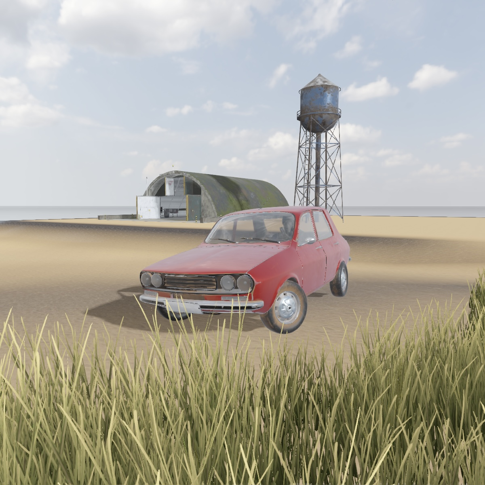
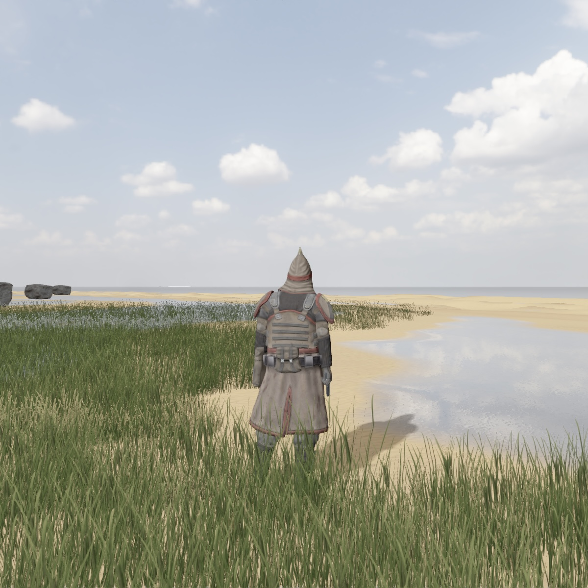
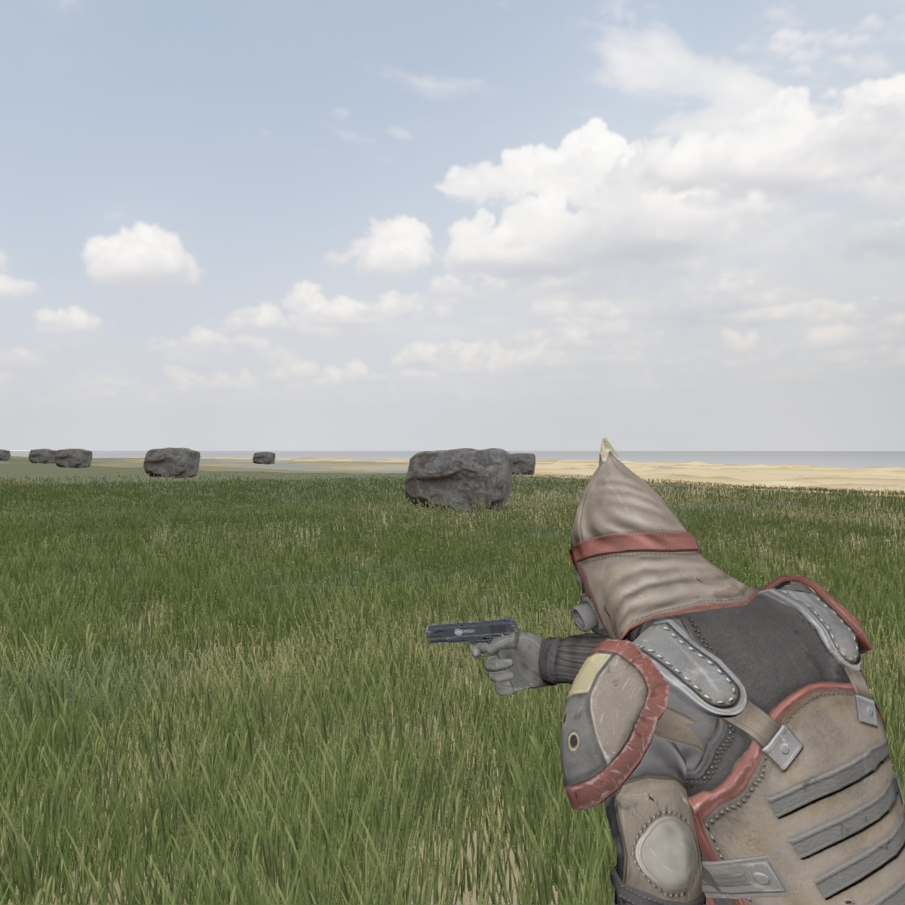
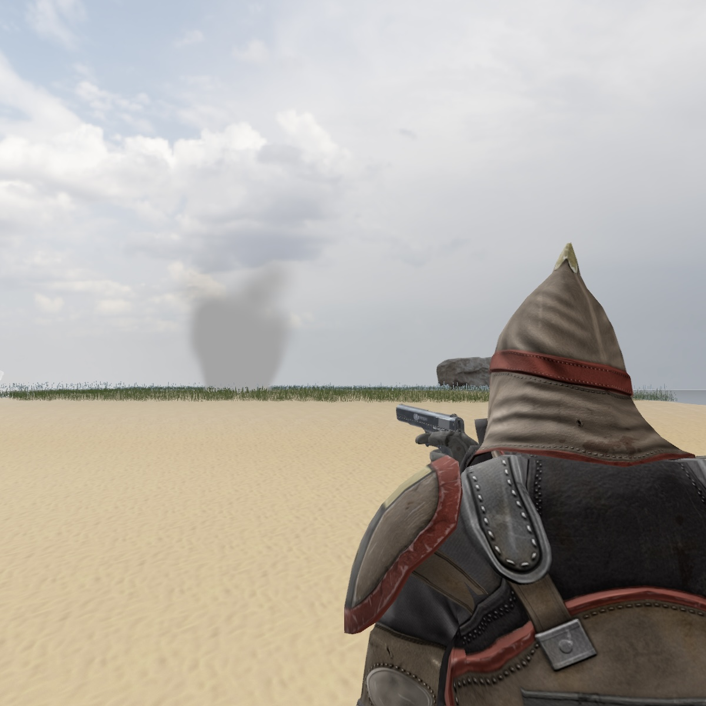

## enigine

is a 3D game engine.

## 🚧 Work In Progress

Documents, API and files possibly have conflicts. Some parts are designed to be a part of the final product and some not. This section will be removed when it's time.

## How to install?

enigine uses `CMake` (build system) and `conan` (package manager).

1. Have C++ on your machine.
2. Install CMake: https://cmake.org/install/
3. Install conan: https://docs.conan.io/en/latest/installation.html
4. Run: `build.sh`

If you're not unlucky, enigine is installed on your machine at the conan cache. Now, you can create a project with the installed library as a dependency. The [examples/hello_world](examples/hello_world) project can be a starting point of your journey.

## How to contribute?

There is a playground project for library development at [dev](dev). Acts as a client project but enigine linked as a source rather than a library. Modify any source and run the project.

## Showcase

## Videos from YouTube

