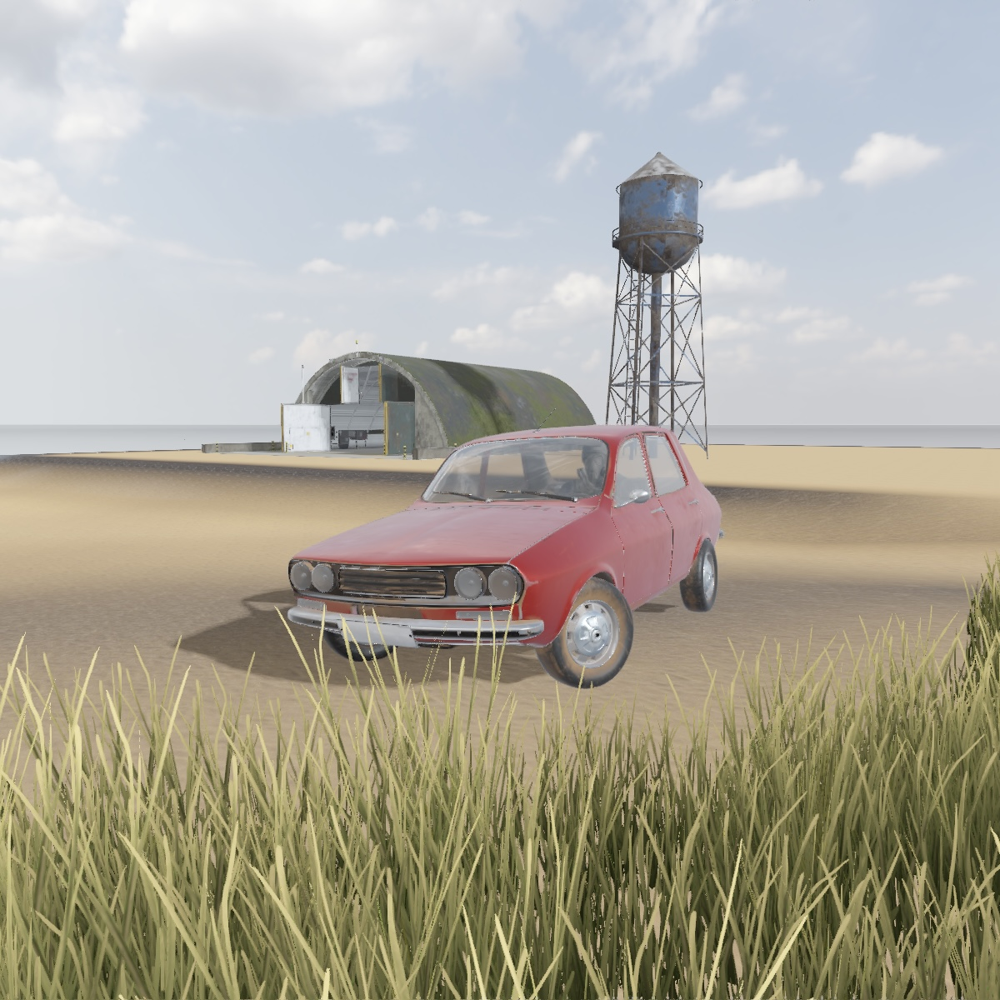
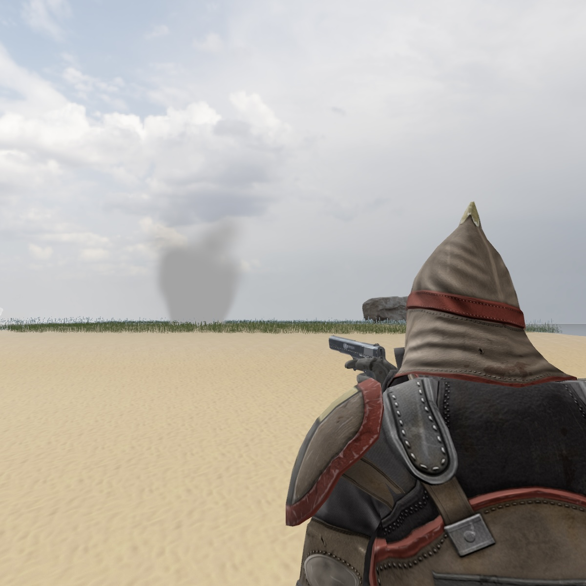

## enigine

is a playground.

## How to run?

enigine uses `CMake` (build system) and `conan` (package manager).

1. Have C++ on your machine.
2. Install CMake: https://cmake.org/install/
3. Install conan: https://docs.conan.io/en/latest/installation.html
4. Run: `build.sh`

## Showcase

## Videos from YouTube

